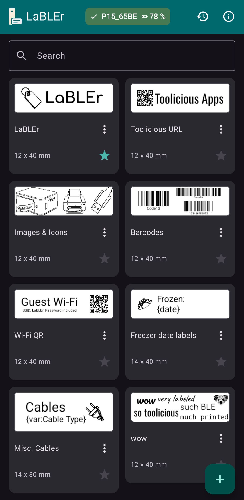
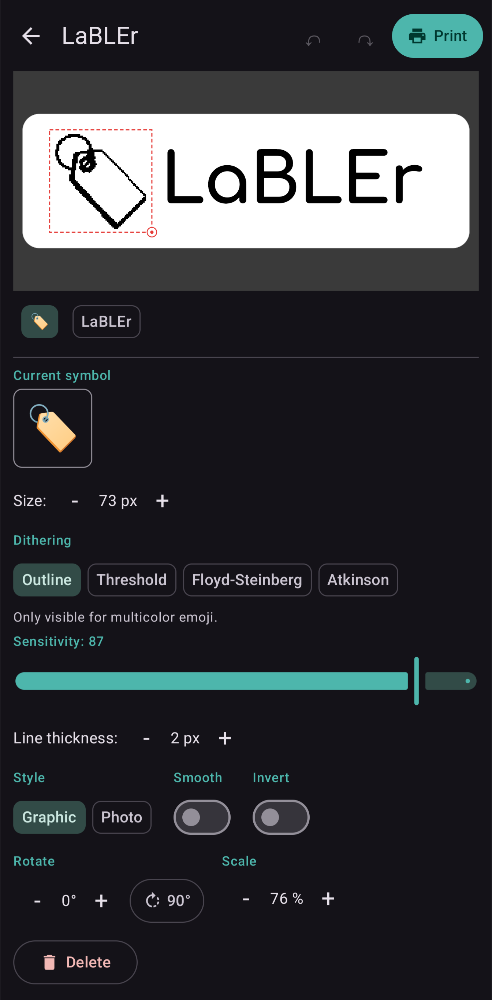
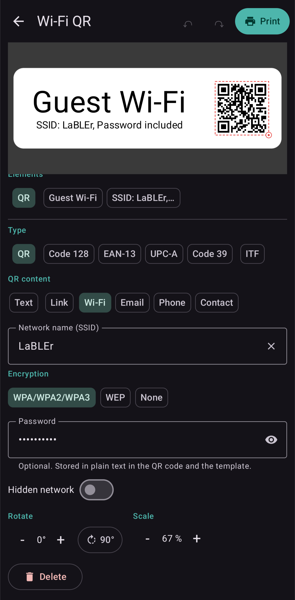
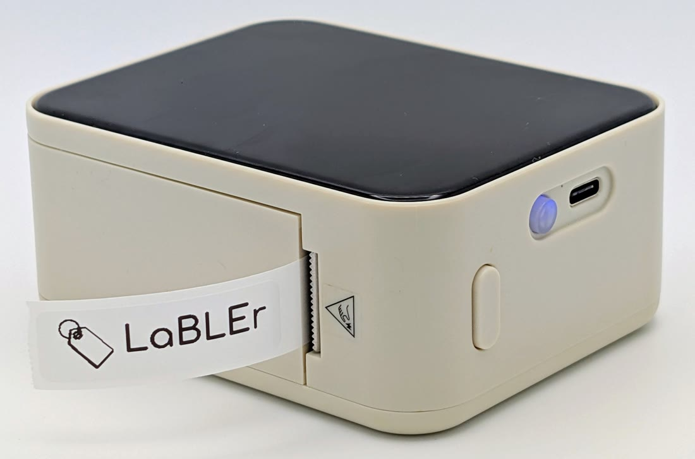

<p align="center">
  
</p>

<h1 align="center">LaBLEr</h1>

LaBLEr is a label printer app for Bluetooth Low Energy thermal label printers of the Marklife family (P15, P12, L13). Design your own labels right on your phone with text, symbols and frames, save them as templates, and print them again anytime.

It talks to the printer directly over Bluetooth LE, with no account, no cloud, and no vendor app.

## Screenshots

<p align="center">
  <a href="docs/overview.png"></a>
  <a href="docs/editor.png"></a>
  <a href="docs/codes.png"></a>
  <br>
  <sub>Your label library, the outline renderer, and QR codes / barcodes (click to enlarge)</sub>
</p>

<p align="center">
  
  <br>
  <sub>A label designed in the app, printed on the P15</sub>
</p>

## Features

- **Design on your phone:** multi-line text (size, bold / italic / underline, alignment, several bundled fonts), symbols and emoji, frames (rectangle, rounded, horizontal or vertical lines), imported images, and **QR codes and barcodes** (Code 128, EAN-13, UPC-A, Code 39, ITF, each with an optional caption) with typed QR content for links, Wi-Fi, email, phone, and contacts.
- **Direct-manipulation editor:** pinch to zoom and pan, tap to select, drag to move, resize from the corner, and rotate, with snapping to the center, the edges, and other elements. Symbols, emoji, and imported images are rendered for the 1-bit thermal head either as a clean **outline** or with dithering. The outline comes in two styles, **Graphic** (region tracing, best for logos and emoji) and **Photo** (Canny edge detection, best for photos), with an optional **Smooth** pass and an **Invert** toggle; the dithering alternatives are a hard threshold or Floyd-Steinberg / Atkinson, with adjustable sensitivity, line thickness, and contrast.
- **Templates:** save, rename, duplicate, and delete; mark favorites; search; export or import a single label as a JSON file, or back up and restore the whole library at once (with a choice to replace or add on import).
- **Placeholders:** drop in the date, the time, a running number, or a free-text value you are asked for at print time. The running number counts up per copy for serial labels.
- **Exact preview and printing:** a 1-bit preview shows precisely what will be printed. Pick the number of copies and die-cut or continuous media, and watch the progress.
- **Print history:** every print is logged and can be reproduced exactly.
- **Stays connected:** reconnects to your saved printer automatically; when the printer reports it, its battery, model, firmware, and hardware version appear in the printer settings.
- **Localized:** per-app language switcher, Material 3 design, light and dark following the system.

## Supported printers

Marklife-family thermal label printers that share the same protocol: **P15, P12, L13**. Only the P15 is verified on-device so far; the others use the same protocol and 12 mm (96-dot) print head.

Requires Android 8.0 (API 26) or newer and a device with Bluetooth Low Energy.

## Building from source

The project uses the Gradle wrapper and a JDK 17 or newer (the JBR bundled with Android Studio works well).

```bash
# Point JAVA_HOME at a JDK, e.g. the Android Studio JBR:
export JAVA_HOME="/path/to/Android Studio/jbr"

# Debug APK:
./gradlew :app:assembleDebug

# Golden-byte unit tests for the protocol module:
./gradlew :printer:test
```

The release build shrinks with R8 (`./gradlew :app:assembleRelease`) to an APK of about 3 MB.

## Project layout

- **`:printer`** is pure Kotlin/JVM with no Android dependencies: the printer protocol, image packing, and print-job building, covered by golden-byte unit tests. It is an independent, from-scratch implementation and bundles no third-party code.
- **`:app`** is the Android app: a single-Activity Jetpack Compose UI (Material 3), Room for templates and print history, DataStore for settings, and kotlinx.serialization for templates and JSON export/import.

## Localization

Available in Chinese (Simplified), Dutch, English, French, German, Italian, Japanese, Polish, Portuguese (Brazil), Russian, Spanish, Turkish, and Ukrainian.

## Privacy

LaBLEr is a fully local app. It talks only to the printer over Bluetooth LE, never to the network. Specifically:

- **No `INTERNET` permission.** It is not declared in the manifest, so the OS will not let the process open a socket. No account, no cloud, no analytics, no crash reporting, no auto-update check, no phone-home.
- **No data collection.** Your templates, print history, and settings live in the app's private storage on the device (Room and DataStore) and never leave it. Export and import go through a file you pick yourself.
- **Permissions, only what a feature needs:**
  - On Android 12 and newer: `BLUETOOTH_SCAN` (with `neverForLocation`) and `BLUETOOTH_CONNECT`, to find the printer and talk to it.
  - On Android 11 and older: `BLUETOOTH` / `BLUETOOTH_ADMIN`, plus `ACCESS_FINE_LOCATION` because the OS required a location permission for any Bluetooth LE scan back then. These are capped to those versions and are never used for location.

The source is open, so you can verify.

## License

[GPLv3-or-later](./LICENSE) (GNU General Public License, version 3 or later). Fork freely; any modified version you distribute must stay under GPL and ship its source.

## Thanks

With thanks to the open-source Chrome web app [BleWebler](https://github.com/josb25/BleWebler), which made the P15 protocol accessible.
